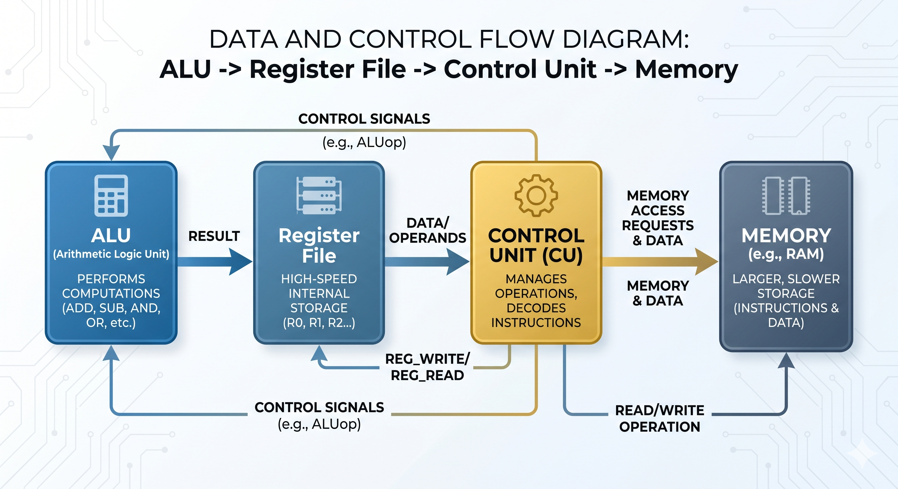
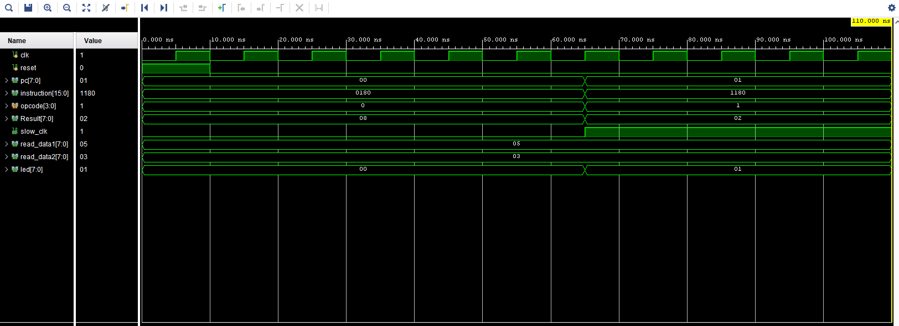

# Mini RISC Processor using Verilog HDL

An 8-bit single-cycle Mini RISC Processor designed using Verilog HDL and implemented on the Basys 3 FPGA board.  
The processor includes an ALU, Register File, Control Unit, Instruction Memory, and Program Counter with real-time FPGA LED visualization.

---

## Features

- 8-bit single-cycle RISC architecture
- Verilog HDL RTL implementation
- ALU operations:
  - ADD
  - SUB
  - AND
  - OR
- Register File implementation
- Program Counter and Instruction Fetch
- Clock Divider for FPGA visualization
- Basys 3 FPGA support
- Behavioral simulation using Vivado
- GitHub Actions CI workflow integration

---

## Processor Architecture

The processor consists of:

- Program Counter (PC)
- Instruction Memory
- Control Unit
- Register File
- Arithmetic Logic Unit (ALU)
- Clock Divider
- FPGA LED Debug Interface

### Block Diagram



---

## Instruction Format

| Bits | Description |
|------|-------------|
| 15:12 | Opcode |
| 11:10 | Destination Register |
| 9:8 | Source Register 1 |
| 7:6 | Source Register 2 |

---

## Supported Instructions

| Opcode | Operation |
|--------|-----------|
| 0000 | ADD |
| 0001 | SUB |
| 0010 | AND |
| 0011 | OR |


### Instruction Execution Flow




---

## FPGA Board

- Board: Basys 3 FPGA
- FPGA: Xilinx Artix-7 XC7A35T
- Toolchain: Vivado Design Suite

---

## Repository Structure

```text
mini-risc-processor-verilog/
│
├── sim/
├── tb/
├── const/
└── docs/
│      └── images/
│          ├── architecture.png
│          ├── waveform.png
│          └── risc_rtl.png
├── .github/workflows/
│
├── README.md
├── LICENSE
└── .gitignore
```

---

## Simulation Result

Behavioral simulation successfully verified:
- Instruction Fetch
- ALU Operations
- Register Read/Write
- Program Counter Increment
- FPGA LED Output

## RTL Schematic


---

## Tools Used

- Verilog HDL
- Vivado Design Suite
- Basys 3 FPGA Board
- GitHub Actions

---

## Contributors

- Lakshmi Omkareswar Thummagunta (RTL Design & Implementation)
- Sriya Adimulam (Verification & Documentation)

---

## Future Improvements

- Pipelined Architecture
- UART Interface
- Memory Instructions
- Seven Segment Display Interface
- Expanded Instruction Set

---

## License

This project is licensed under the MIT License.